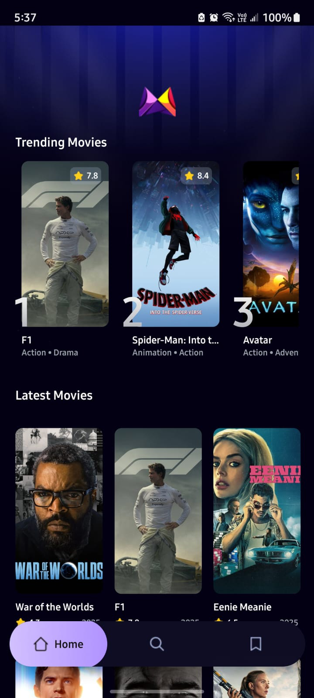

# 🎬 MovieDeep

MovieDeep is a **React Native mobile app built with Expo** that lets you discover and explore your favorite movies.  
You can track trending movies, search for specific titles, save favorites, and view detailed movie information including trailers and official sites.

---

## 🚀 Features

- Discover movies powered by **TMDB RESTful APIs** (over 1,000,000+ movies available)
- Track trending movies (updates dynamically based on popularity algorithm)
- Save your favorite movies for quick access
- Search for any movie by title
- View full movie details with:
  - Trailer links
  - Homepage/official site links (if available)
- Backend powered by **Appwrite**
- Persistent storage with **AsyncStorage**

---

## 📥 Download

👉 [Download MovieDeep APK](https://github.com/abdullah12q/MovieDeep-mobile-app/releases/latest/download/MovieDeep-v1.0.0.apk)

---

## 🛠️ Tech Stack

- **React Native** (Expo Managed Workflow)
- **Typescript** for type safety
- **Tailwind CSS (Nativewind)** for styling
- **Expo Router** (Stack + Tabs navigation)
- **Appwrite** backend service
- **Async-Storage** for persistent local storage

---

## 📱 Screenshots

<p align="left">
  
  
  
  
</p>

---

## 📂 Project Setup

Clone the repo:

```bash
git clone https://github.com/your-username/MovieDeep.git
cd MovieDeep
```

Install dependencies:

```bash
npm install
```

Run the app:

```bash
npx expo start
```

---

## 🔑 Environment Variables

Create a `.env` file in the root directory with:

```
EXPO_PUBLIC_MOVIE_API_KEY=your_api_key_here
EXPO_PUBLIC_APPWRITE_PROJECT_ID=your_project_id
EXPO_PUBLIC_APPWRITE_DATABASE_ID=your_db_id
EXPO_PUBLIC_APPWRITE_COLLECTION_ID=your_collection_id
EXPO_PUBLIC_APPWRITE_ENDPOINT=your_appwrite_endpoint
```

---

## 👨‍💻 Acknowledgments

- **JS Mastery** – for Figma design, icons, and assets
- **TMDB** – for the movie data API

---

## 📌 License

This project is licensed under the MIT License - see the [LICENSE](LICENSE) file for details.
